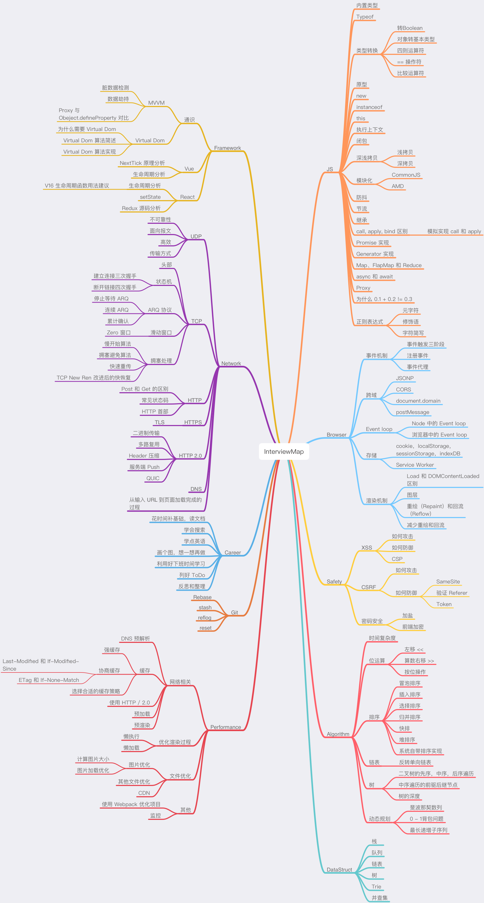

<h1 align="center">
  Interview Map
</h1>

<h4 align="center">This is a map that can help you make a better preparation for the next interview</h4>

## Foreword

> When you are old, looking back the whole lifetime, you will find out: When to study abroad, when to decide the first occupation, when to choose the other half to fall in love, when to marry, all these are actually great changes in fate. We were just standing at the three-forked intersection and seeing the wind blows the clouds and sails. The day you made your choice was quite dull and peaceful in the diary and it was thought to be an ordinary day in a life. 
> A project to change the interview — Interview Map.

The best job-hopping seasons, September and October are coming（For Chinese, there is an idiom called "Golden September and Silver October”）, most people must be eager to try and prepare to challenge better job opportunities. Then, the interview must definitely be the biggest challenge.

For the interview, the usual accumulation of learning is definitely necessary, but the preparation before the interview is also crucial.

A few months ago, I personally set up a small team. It took half a year to search for interview questions from the big company, filtering out nearly 100 knowledge points, writing the content and translate them all into English. Today, we finally open source the first version and the total number of words has reached more than 100,000 at present. 

We think that the blind memory of the interview questions is not very useful. Only when you are familiar with the various knowledge points and be capable of integrating them, can you get through the interviews. This map currently contains nearly a hundred high-frequency knowledge points, no matter the preparation before the interview or the usual study, we believe that it will definitely help you. The current content includes JS, network, browser related, performance optimization, security, framework, Git, data structure, algorithm, etc. Whether it is basic or advanced learning or source code interpretation, you can get a satisfactory answer in this map, we hope that the map can help you better prepare for the interview.

The contents of the repository will update continuously, and more contents will be added into the repository later, such as system design, the blockchain, operation and maintenance, backend, etc. Of course, these are not my strengths, I will invite friends who have good experience in this area to write content.

# outline

## Contributing
If you find something wrong with the knowledge point or there’s a Bug in the code, welcome to submit English [issue](https://github.com/KieSun/Front-End-Interview-Map/issues/new), if your English is not good, please discuss it in  [this issue](https://github.com/KieSun/InterviewMap/issues/18) 

If you think there is a good knowledge point  or would like to participate in translation and proofreading, welcome to pull request[PR](https://github.com/KieSun/Front-End-Interview-Map/pulls)，or you can contact me <zx597813039@gmail.com>

## Todo

* Complete the content about CSS 
* Complete the content about Webpack
* Complete the content about miniprogram
* Improve the content of the framework

The above content is expected to be updated completely in September, and welcome to participate in the construction of this map.

## Communicate and share
If you want to communicate and share with others about the content of this map, you can join [communicate group](https://github.com/KieSun/InterviewMap/issues/19)

## Support us
If the map helps you with your interview or study, you can [support our work](https://github.com/KieSun/InterviewMap/issues/20)

## protocol
[MIT](LICENSE). Copyright (c)