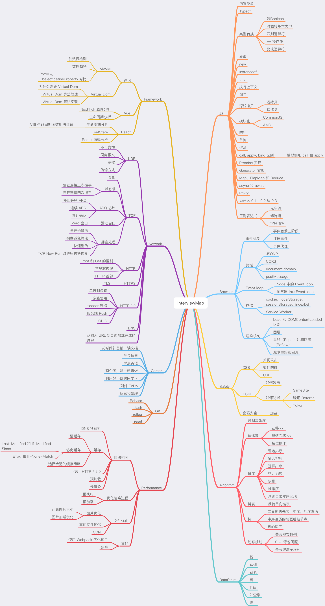

<h1 align="center">
  Interview Map
</h1>

<h4 align="center">这是一份能让你更好准备下一次面试的图谱</h4>

  
  

## 前言

> 当你老了，回顾一生，就会发觉：什么时候出国读书，什么时候决定做第一份职业，何时选定对象而恋爱，什么时候结婚，其实都是命运的巨变。只是当时站在三岔路口，眼见风云千樯，你做出选择的那一日，在日记上，相当沉闷和平凡，当时还以为是生命中普通的一天。
>
> 一个改变面试的项目 -- 面试图谱。

金九银十的秋招季近在眼前，想必大家也都心痒难耐，准备挑战更好的工作机会。那么，面试肯定是最大的挑战。

对于面试来说，平时的积累肯定是必须的，但是在面试前的准备也是至关重要的。

在几月前我个人组建了一个小团队，花了将近半年的时间寻找大厂的面试题，筛选出了近百个知识点然后成文，并全部翻译为英文。今天，终于开源出了第一个版本，目前总字数已高达 10 余万字。

我们认为，一味的背面试题是没多大作用的。只有熟悉了各个知识点并融会贯通，才能在面试中披荆斩棘。本图谱目前包含了近百个高频知识点，无论是面试前的准备还是平时学习中的查漏补缺，我们相信肯定能帮助到大家。目前内容包含了 JS、网络、浏览器相关、性能优化、安全、框架、Git、数据结构、算法等内容，无论是基础还是进阶，亦或是源码解读，你都能在本图谱中得到满意的答案，希望这个面试图谱能够帮助到大家更好的准备面试。

该仓库内容会持续更新，后期将会包含更多的内容，比如：系统设计、区块链、运维、后端等等，当然这些不是我的强项，我会邀请这方面有不错经验的朋友来书写内容。

## 大纲

## 求职

目前作者正在寻找工作机会，如果你有杭州前端岗位的内推，欢迎和我联系 zx597813039@gmail.com

## 面试咨询

如果你对于如何书写简历或者如何在面试中更好的的回答有疑虑，我们也提供付费服务，有意可咨询微信（597813039）

## 贡献

如果你发现知识点内容有出错或者代码有 Bug，欢迎你提交英文 [issue](https://github.com/KieSun/Front-End-Interview-Map/issues/new)，如果你英文不好的话，请在 [该 issue](https://github.com/KieSun/InterviewMap/issues/18) 中讨论

如果你认为有一个不错的知识点或者也想参与翻译校对，欢迎提交 [PR](https://github.com/KieSun/Front-End-Interview-Map/pulls)，或者也可以联系我 <zx597813039@gmail.com>

## Todo

- 完成 CSS 内容
- 完成 Webapck 内容
- 完成小程序相关内容
- 完善关于框架的内容

以上内容预计将于 9 月份更新完毕，欢迎你一起参与本图谱的建设。

## 阅读

[线上版本阅读更清晰](https://yuchengkai.cn/docs/zh/)

## 交流分享

如果你想与他人交流关于本图谱的内容，可以加入 [交流群](https://github.com/KieSun/InterviewMap/issues/19) 或者 [gitter 聊天室](https://gitter.im/interview-map/Lobby)，请务必使用英文交流，谢谢。

## 支持我们

如果图谱在面试中或者学习中帮助到你了，你可以 [支持我们的工作](https://github.com/KieSun/InterviewMap/issues/20)

## 协议

[MIT](LICENSE). Copyright (c)
