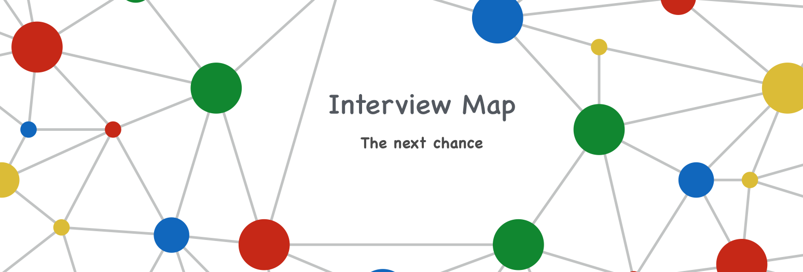
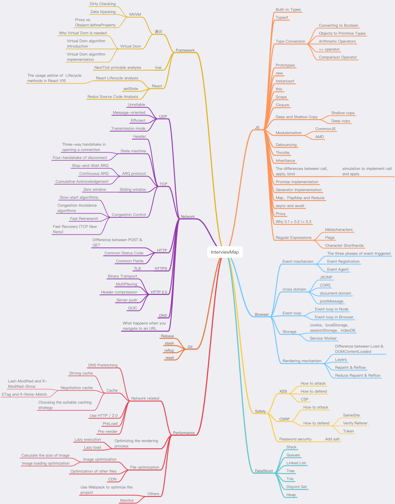

<h1 align="center">
  Interview Map
</h1>

<h4 align="center">This is a map that can help you prepare better for the next interview</h4>

  
  

[中文版本](./README-ZH.md)

## Foreword

> When you are old, looking back on your life, you will find out: when to study abroad, when to decide on your first occupation, when to choose the other half to fall in love with, when to marry; all of these are great changes in fate. We were just standing at the three-forked intersection and seeing the wind blow the clouds and sails. The day you made your choice was a quite dull and peaceful day in the diary, and it was thought to be an ordinary day in your life.
> A project to change the interview — Interview Map.

The best job-hopping months, September and October, are coming（in Chinese, there is an idiom called "Golden September and Silver October”). Most people will be eager to prepare for and to pursue better job opportunities. The interview will be their biggest challenge.

For the interview, the usual accumulation of learning is necessary, but the preparation before the interview is also crucial.

A few months ago, I set up a small team. It took us half a year to search for interview questions from big companies, filtering out nearly 100 knowledge points, writing the content and translating it all into English. Today, we finally release the first version and the total number of words has reached more than 100,000 so far.

We think that rote learning of the interview questions is not very useful. Only when you are familiar with the various knowledge points and are capable of integrating them, can you get through the interviews. This InterviewMap currently contains nearly a hundred high-frequency knowledge points. No matter the preparation before the interview or the study, we believe that it will help you. The current content includes JS, network, browser related, performance optimization, security, framework, Git, data structures, algorithms, etc. Whether it is basic or advanced learning or source code interpretation, you can get a satisfactory answer in this InterviewMap, and we hope that the InterviewMap can help you better prepare for your interview.

The contents of the repository will update continuously, and more content will be added into the repository later, such as system design, the blockchain, operating and support, backend, etc. Of course, these are not my strengths, and I will invite friends who have good experience in this area to write this content.

# Outline

## Contributing
If you find something wrong with the knowledge point or there’s a bug in the code, you are welcome to submit an English [issue](https://github.com/KieSun/Front-End-Interview-Map/issues/new). If your English is not good, please discuss it in  [this issue](https://github.com/KieSun/InterviewMap/issues/18).

If you think you know of a good knowledge point to contribute, or would like to participate in translation and proofreading, you are welcome to submit a [PR](https://github.com/KieSun/Front-End-Interview-Map/pulls), or you can contact me at <zx597813039@gmail.com>.

## Todo

* Complete the content about CSS
* Complete the content about Webpack
* Complete the content about the mini program (WeiXin)
* Improve the content of the framework

The above content is expected to be updated completely in September, and you are welcome to participate in the construction of this interviewmap.

## Reading

[Online version is clearer to read](https://yuchengkai.cn/docs/).

## Communicate and share
If you want to communicate and discuss the content of this interviewmap with others, you can join [communicate group](https://github.com/KieSun/InterviewMap/issues/19) or [gitter](https://gitter.im/interview-map/Lobby?utm_source=share-link&utm_medium=link&utm_campaign=share-link).

## Support us
If the interviewmap helps you with your interview or study, you can [support our work](https://github.com/KieSun/InterviewMap/issues/20).

## License
[MIT](LICENSE). Copyright (c)
